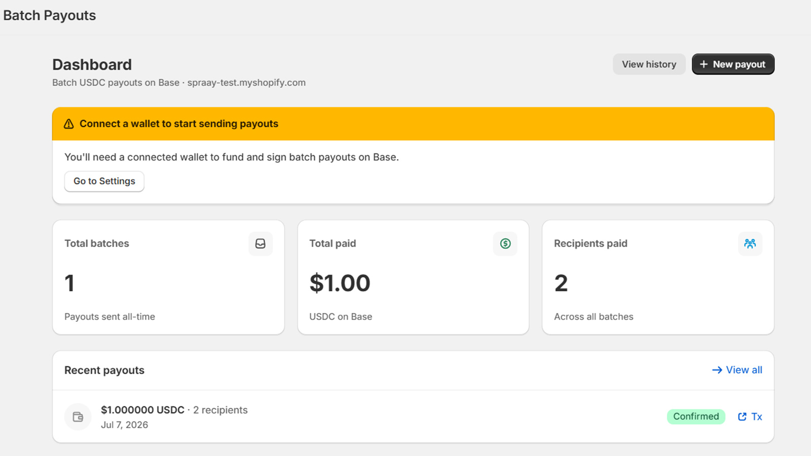
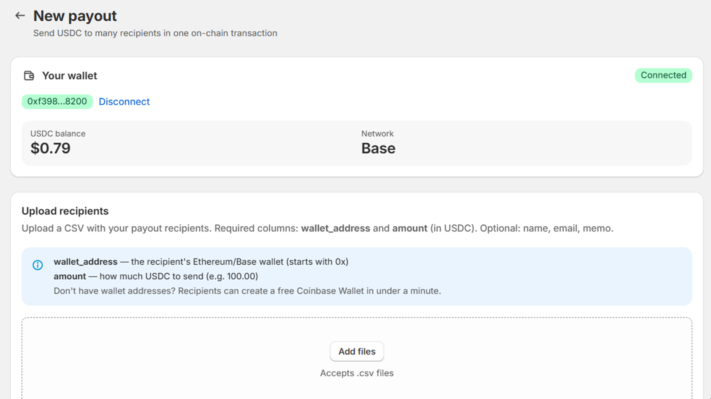
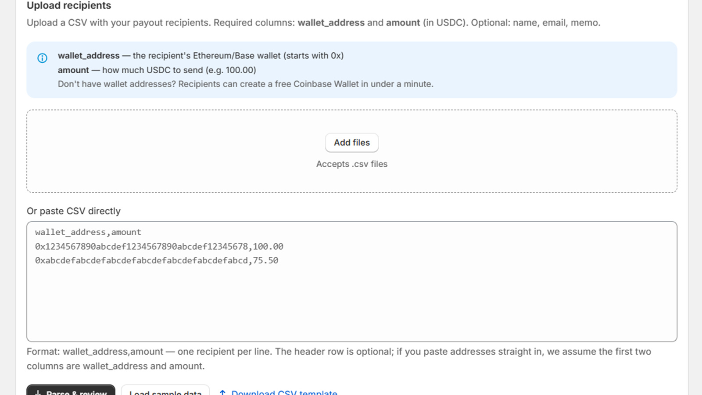
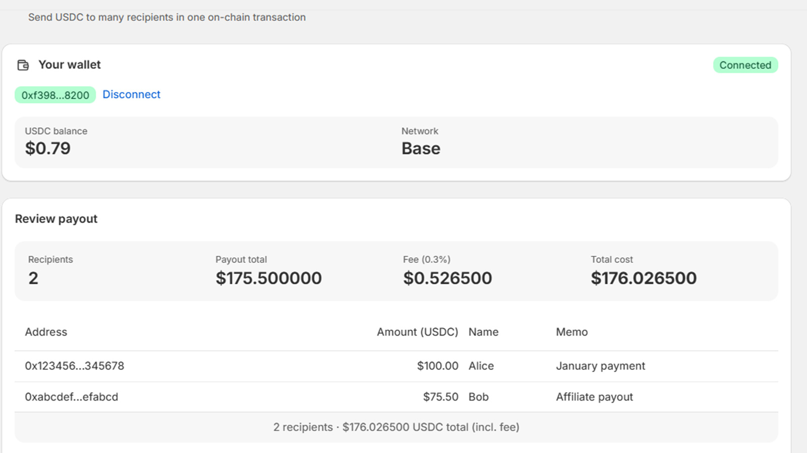
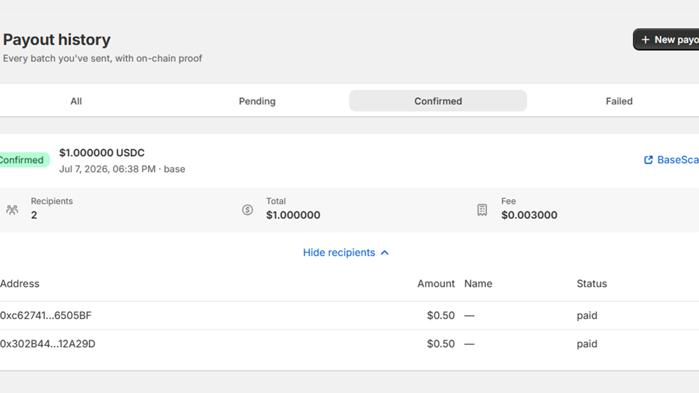

<h1 align="center">Spraay Batch Payouts</h1>

<p align="center">
  <strong>Open-source Shopify app for batch USDC payouts on Base.</strong><br>
  Pay hundreds of affiliates, creators, and suppliers in a single on-chain transaction — from inside your Shopify admin.
</p>

<p align="center">
  <a href="LICENSE"></a>
  
  
  
</p>

---

## What it does

Spraay is built for paying people **out**, not for taking payments in. Most crypto apps
on Shopify are checkout tools; this is the inverse.

- **Send USDC to many wallets in one transaction** — pay network gas once instead of once per recipient.
- **Upload a CSV or paste a list** → review recipient count, payout total, and the 0.3% fee → approve USDC → execute.
- **Track every batch** in a payout history with on-chain BaseScan verification links.
- **Built with Shopify Polaris**, embedded natively in the Shopify admin.
- **Non-custodial** — you connect your own wallet (MetaMask, Coinbase Smart Wallet), and USDC moves from your wallet straight to recipients. Spraay never holds funds.

## Screenshots

| Dashboard | New payout |
| :-- | :-- |
|  |  |
| All-time batches, total paid, and recipients paid. | Connected wallet, live USDC balance on Base. |

| Add recipients | Review before sending |
| :-- | :-- |
|  |  |
| Drop a CSV or paste `wallet_address,amount` — the header row is optional. | Recipient count, payout total, 0.3% fee, and total cost — before anything is signed. |

| Payout history |
| :-- |
|  |
| Every batch you've sent, filterable by status, each with on-chain proof. |

## Quick start (self-hosted)

This app is distributed as source. You host it yourself and install it on your store
as a **custom distribution** app — there is no App Store listing to install from.

### Prerequisites

- **Node.js 20+** (`>=20.19 <22 || >=22.12`)
- A **Shopify Partner account** — free at [partners.shopify.com](https://partners.shopify.com/signup)
- A **PostgreSQL database** — a [Supabase](https://supabase.com) free-tier project works fine
- A host that can run a Node.js container — **[Railway](https://railway.com)** is what this repo is configured for

### Step 1 — Create a Shopify app

1. Go to [dev.shopify.com](https://dev.shopify.com) → **Apps** → **Create app** → choose **Custom distribution**.
2. Set the **App URL** to your hosting domain, e.g. `https://your-app.up.railway.app`.
3. Set the **redirect URLs** to all three of:
   ```
   https://your-domain/auth/callback
   https://your-domain/auth/shopify/callback
   https://your-domain/api/auth/callback
   ```
4. Copy the **Client ID** and **Client Secret** — these become `SHOPIFY_API_KEY` and `SHOPIFY_API_SECRET`.

> The app requests **no access scopes**. It never reads or writes Shopify store data —
> it only stores your own payout records. See `scopes` in [`shopify.app.toml`](shopify.app.toml).

### Step 2 — Set up the database

1. Create a Supabase project.
2. From **Project Settings → Database**, copy two connection strings:
   - the **transaction pooler** URL (port `6543`) → `DATABASE_URL`
   - the **session pooler / direct** URL (port `5432`) → `DIRECT_URL`
3. Append `?schema=shopify` to both so the app's tables live in their own schema.

### Step 3 — Deploy

#### Option A — Railway (recommended)

[](https://railway.com/new/template?template=https%3A%2F%2Fgithub.com%2Fplagtech%2Fspraay-shopify&envs=SHOPIFY_API_KEY%2CSHOPIFY_API_SECRET%2CSHOPIFY_APP_URL%2CDATABASE_URL%2CDIRECT_URL%2CPORT&SHOPIFY_API_KEYDesc=Client+ID+from+your+Shopify+app&SHOPIFY_API_SECRETDesc=Client+secret+from+your+Shopify+app&SHOPIFY_APP_URLDesc=The+public+HTTPS+URL+of+this+service+%28no+trailing+slash%29&DATABASE_URLDesc=Pooled+Postgres+connection+string+%28port+6543%29&DIRECT_URLDesc=Direct+Postgres+connection+string+for+migrations+%28port+5432%29&PORTDesc=Leave+as+3000+to+match+the+Dockerfile&PORTDefault=3000)

Or do it manually:

1. Fork this repo.
2. In Railway, create a project from your fork. It builds from the included [`Dockerfile`](Dockerfile) via [`railway.json`](railway.json).
3. Add the environment variables from [`.env.example`](.env.example).
4. **Set `PORT=3000`.** This one is load-bearing — see [Deployment notes](#deployment-notes).
5. Generate a public domain and set `SHOPIFY_APP_URL` to it, then redeploy.

#### Option B — Manual

```bash
git clone https://github.com/plagtech/spraay-shopify.git
cd spraay-shopify
npm install
cp .env.example .env
# Fill in your values in .env
npx prisma migrate deploy
npm run build
npm start
```

### Step 4 — Install on your store

1. In [dev.shopify.com](https://dev.shopify.com) → your app → **Install on a development store** to test.
2. For production, generate an install link from the Dev Dashboard and open it on your store.

### Local development

```bash
npm install
npm run dev     # shopify app dev — creates a tunnel and injects dev credentials
```

The Shopify CLI supplies `SHOPIFY_API_KEY`, `SHOPIFY_API_SECRET`, and `SHOPIFY_APP_URL`
during `npm run dev`, so your local `.env` only needs `DATABASE_URL` and `DIRECT_URL`.

## Architecture

| Layer | Choice |
| :-- | :-- |
| Framework | Remix + [`@shopify/shopify-app-remix`](https://www.npmjs.com/package/@shopify/shopify-app-remix) |
| UI | Shopify Polaris, embedded via App Bridge |
| Wallet | wagmi + viem — MetaMask, Coinbase Smart Wallet |
| Chain | Base (chain ID `8453`) |
| Batch contract | [`0x1646452F98E36A3c9Cfc3eDD8868221E207B5eEC`](https://basescan.org/address/0x1646452F98E36A3c9Cfc3eDD8868221E207B5eEC) |
| USDC | [`0x833589fCD6eDb6E08f4c7C32D4f71b54bdA02913`](https://basescan.org/address/0x833589fCD6eDb6E08f4c7C32D4f71b54bdA02913) |
| Database | PostgreSQL via Prisma (Supabase) |
| Hosting | Railway (Dockerfile included) |

On-chain execution happens **client-side**: the merchant's browser signs the USDC
approval and the `sprayToken` batch call with their own wallet. The server only
persists a record of each batch — it holds no keys and never touches funds.

### Project layout

```
app/
  routes/
    app._index.jsx        Dashboard with stats
    app.payouts.new.jsx   The payout flow: upload → review → approve → execute → record
    app.history.jsx       Payout history with status filters
    app.settings.jsx      Wallet configuration
    privacy.jsx           Public privacy policy (no Shopify session required)
    webhooks.*.jsx        App lifecycle + GDPR compliance webhooks
  components/
    WalletButton.jsx      Wallet connect button (SSR-safe)
    WalletProvider.jsx    wagmi + react-query providers
  lib/
    spraay.js             Batch contract ABI, token addresses, CSV parsing
    wagmi.config.js       Chains, connectors, transports
  shopify.server.js       Shopify auth + session storage config
prisma/                   Schema and migrations
```

## How the fee works

A **0.3% protocol fee** is collected on-chain by the Spraay batch contract during
execution. It is a smart contract fee, not an app subscription — there is nothing to
bill and no plan to pick. The merchant's wallet sends USDC directly to recipients, and
Spraay never custodies funds.

Self-hosting this app does not remove the fee: it is enforced by the deployed contract
on Base, not by this codebase.

## CSV format

Two columns are required, and the header row is optional — if you paste bare rows,
the first two columns are assumed to be the address and the amount.

```csv
wallet_address,amount
0x1234567890abcdef1234567890abcdef12345678,100.00
0xabcdefabcdefabcdefabcdefabcdefabcdefabcd,75.50
```

Optional extra columns: `name`, `email`, `memo`. There's a **Download CSV template**
link and a **Load sample data** button on the payout screen.

## Deployment notes

- **`PORT=3000` is load-bearing on Railway.** The Dockerfile's `EXPOSE 3000` sets the
  service domain's `targetPort` to 3000, but `remix-serve` otherwise binds to Railway's
  injected `PORT` (8080). The mismatch makes Railway's proxy route to `:3000` where
  nothing is listening → **502 "Application failed to respond" on every route**. If you
  recreate the service, re-add this variable.
- **A 502 while the deployment shows "Online" is a port/proxy mismatch, not a crash.**
  Check the logs first: if `prisma migrate deploy` succeeds and `remix-serve` prints its
  listen URL, the app is healthy and the problem is routing.
- Migrations run automatically on boot via `npm run docker-start`
  (`prisma generate && prisma migrate deploy`, then `remix-serve`).

## Security

- `.env` is gitignored — never commit it. `SHOPIFY_API_SECRET` and your database URLs
  are secrets; `SHOPIFY_API_KEY` (the Client ID) is public and ships in the browser bundle.
- Webhook handlers verify Shopify's HMAC signature via `authenticate.webhook()` before
  doing any work.
- The app stores shop domain, wallet addresses, and payout records. It stores no customer
  personal data — see the bundled privacy policy at `/privacy`.

Found a security issue? Please report it privately to **support@spraay.app** rather than
opening a public issue.

## Contributing

Issues and pull requests are welcome. Run `npm run lint` before opening a PR.

## License

[MIT](LICENSE) © 2026 PlagTech

## Links

- **Spraay Protocol** — https://spraay.app
- **Gateway** — https://gateway.spraay.app
- **MCP Server** — https://smithery.ai/servers/Plagtech/Spraay-x402-mcp
- **Twitter** — [@Spraay_app](https://twitter.com/Spraay_app)
- Built by [@lostpoet](https://twitter.com/lostpoet)
